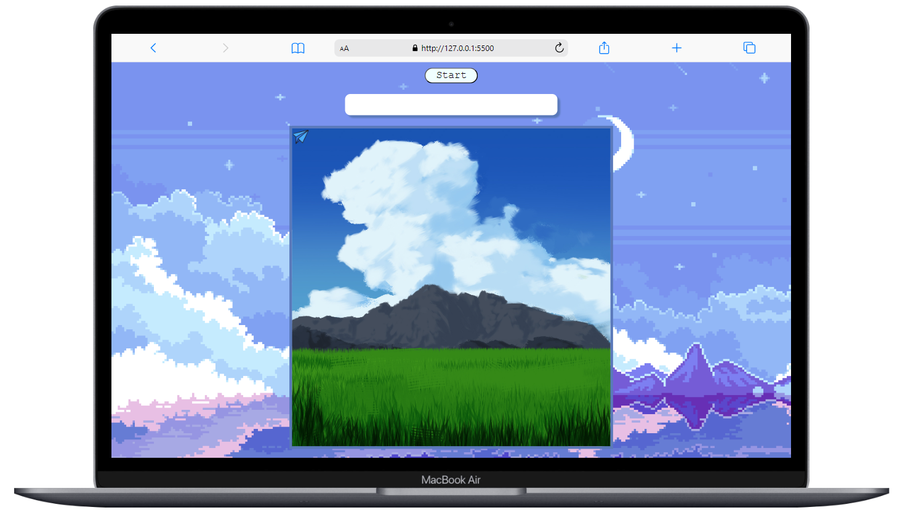

<h2 align="center" > ⭐ TouchMe ⭐ </h2>

<h3 align="center">Languages and Tools:</h3>

    

  

(In beta phase)

- Game that consists of touching the object in the established time a number of times.

> To start, click on the start button and the countdown will start and you will have to reach the target number of objects before the time runs out.

## Phone

-------------------------------------------

